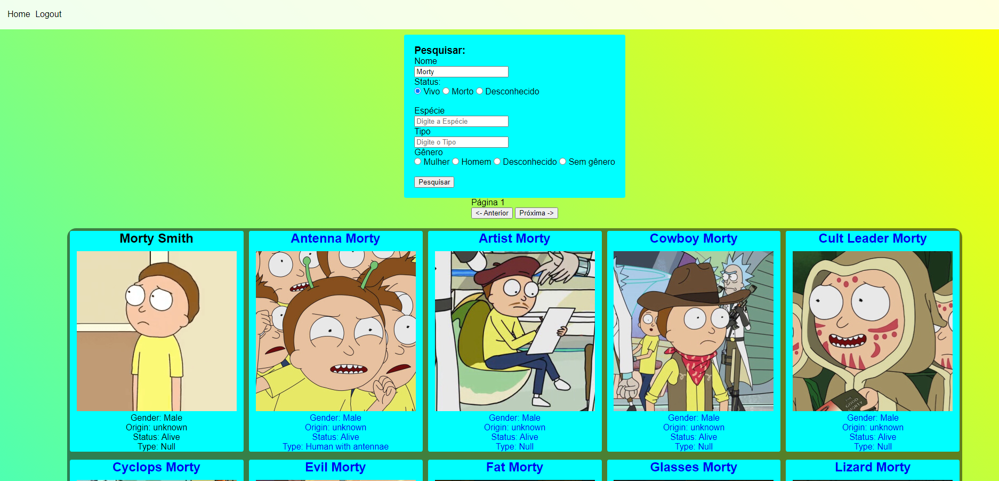

# Teste - João Vitor Matos Gouveia

## Para rodar
- Primeiramente será necessário um servidor web, eu utilizei o XAMPP para isso, inicie o Apache que irá ser responsável pelos arquivos PHP e inicie o MySQL para ser o sistema gerenciador de banco de dados.

- Crie o banco de dados `teste-sig` no MySQL, ele precisa ter exatamente esse nome, ou então altere o nome em $bd no arquivo `Conn.php`.

- No MySQL, execute o seguinte comando para criar a tabela `users`, a tabela responsável pelo armazenamento dos dados de login. 

" CREATE TABLE `teste-sig`.`users` (`id` INT NOT NULL AUTO_INCREMENT , `email` VARCHAR(255) NOT NULL , `password` VARCHAR(255) NOT NULL , PRIMARY KEY (`id`)) ENGINE = InnoDB; "

- Coloque a pasta `test-sig` (diretório atual) desse projeto na pasta htdocs do xamp e acesse `http://localhost/test-sig` no seu navegador.
- O design do site foi pensado para ser visto em telas de computador 1920x1080p

## Processo de desenvolvimento
- Na criação do banco de dados, optei pelo MySQL por ser um gerenciador de banco de dados rápido, amplamente utilizado e por já possuir experiência com ele. 
- O arquivo index.php (fora da pasta view) é responsável por redirecionar os usuários para as páginas corretas. Já o index.php na pasta View irá solicitar que o usuário passe pela autenticação, fazendo login ou criando a conta.
- O sistema de autenticação foi criado utilizando arquitetura MVC, sendo assim, no caso de criação de conta, o usuário acessa o register.php (View) digita os dados e o script da página envia esses dados para o `UserRoutes`, lá é identificado que o usuário quer se registrar, e é chamado a função `register` do `UserController` (responsável pela lógica de negócios), no Controller serão feitas as validações como checar o tamanho da senha e se a "senha" é igual ao campo "confirme a senha". Passando por essas validações, a senha passa por um hash para ficar criptografada, o `UserModel` (responsável por manipular o banco de dados) é chamado com a função `searchUser` para checar se aquele email já foi cadastrado e depois a função `insertUser` para finalmente cadastrar o usuário.
- Depois de implementar o login, o foco foi garantir que as páginas `home` e `card`, só seriam acessadas por quem estivesse logado, então o arquivo `protect.php` foi criado, ou seja, assim que o usuário entrar na página, esse arquivo irá olhar nas sessões se tem um login ativo. Já o arquivo `logout.php` exclui a sessão e redireciona o usuário para o início.
- Para as páginas que dependiam da API do Rick and Morty, eu utilizei o javascript para fazer as requisições na API, mas como foi pedido em MVC, resolvi fazer o getCharacters nesse formato como exemplo, ele chama o `CharactersRoutes`, depois chama o `CharactersController` para se comunicar com a API e responde para a View. No entanto, essa forma não achei muito prática, pois como é uma requisição simples, fazer direto do javascript é mais direto, deixei como comentário embaixo de como seria. Por esse mesmo motivo, a função `search` (no script) manda a requisição direto na API e depois preenche a tela manipulando o DOM com os cards, o mesmo vale para a páginação.

# Possíveis melhorias (não foram feitas porque isso é "apenas" um teste)
- Guardar as informações de banco de dados em um arquivo .env para manter esses dados ocultos.
- Nav-bar é um código que se repete, poderia ter sido criado separado e importado.
- CSS poderia ser melhor pensado e responsivo, mas o foco aqui estava nas funcionalidades do sistema. 

## Imagens (clique para aumentar a resolução)

### Página inicial

### Página de login

### Página de cadastro

### Página de cards

### Página de pesquisa por "Morty" e "Vivo"

### Página de carta individual

